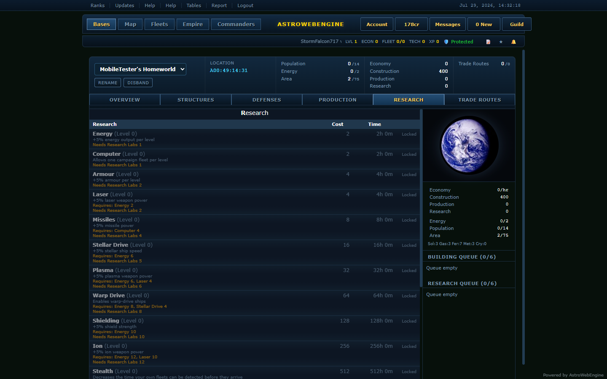
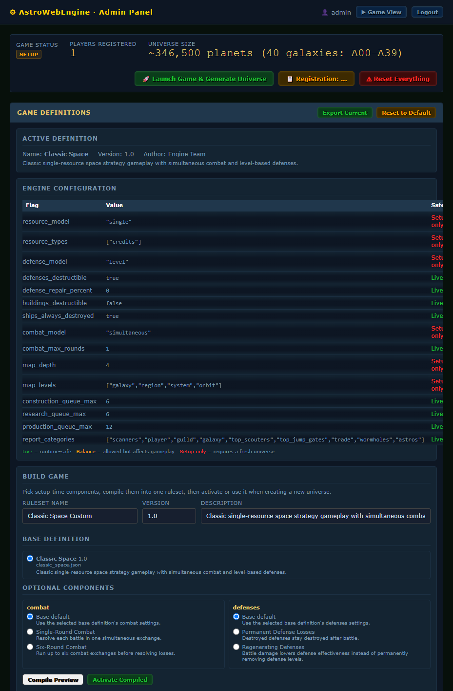
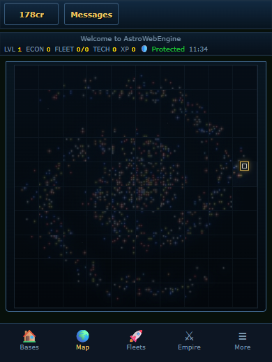

# AstroWebEngine

**A self-hostable engine for browser-based, multiplayer space-strategy games — with no hardcoded ruleset.**

[](https://github.com/AstroWebEngine/astrowebengine/actions/workflows/tests.yml)

Units, structures, research, defenses, combat behavior, the resource model and the
map topology all live in a **game definition** (JSON). The engine code itself knows
nothing about any particular game: swap the definition and you get a different game,
not a reskin of the same one.

[**Live demo**](https://play.astrowebengine.com) · [Website](https://www.astrowebengine.com) · [Quick start](QUICK_START.md) · [Docker](DOCKER.md) · [Code examples](CODE_EXAMPLES.md)



## Why it's different

Most open-source browser 4X projects are one game with the rules baked into the
source. Here, the rules are data, and the admin panel is a game *compiler*: pick a
base definition, layer optional rule fragments, compile, activate. No restart, no
code edit, no redeploy.



Engine flags that reshape gameplay, set per definition:

| Flag | Options | Effect |
|---|---|---|
| `resource_model` | `single` / `multi` | One currency, or metal/crystal/gas-style economies |
| `defense_model` | `level` / `count` | Upgradeable turret levels, or build N discrete units |
| `defenses_destructible` | `true` / `false` | Permanent losses, or regenerating effectiveness % |
| `combat_model` | `simultaneous` / `rounds` | One exchange, or up to `combat_max_rounds` |
| `shield_bounce_threshold` | off / fraction | A shot under this fraction of the target's shields is absorbed entirely |
| `rapid_fire` (per unit) | `{target: shots}` | Hard counters — a hull's shots multiply against the units it answers |
| `stat_req` (per spec) | `{stat: amount}` | Gate on a base's scale — a tech that needs 300,000 free energy, say |
| `map_depth` | `4` / `3` | galaxy→region→system→orbit, or galaxy→system→slot |
| `map_topology` | `hierarchy` / `graph` | Nested coordinates, or systems linked by lanes and wormholes |
| `galaxy_network` | `ring`, `line`, `tree`, `small_world`, `wormhole_only`, … | How galaxies connect and how travel distance is computed |
| `economy_actions` | off / `action_points` | Free actions, or a regenerating action-point budget per player |
| `win_condition` | incl. `annihilation` | Score-based, or last team standing |

## Features

- **Composable rule fragments** — combine combat, defense, resource and map
  fragments over a base definition via the admin Build Game UI.
- **Mod system** — content overlays (pure data) and behavioral mods (Python hooks
  such as `on_battle`, `compute_victory`). Seven ship with the engine.
- **Combat engine** — proportional damage allocation with sub-linear weighting,
  overflow redistribution, shields with per-weapon passthrough, per-unit rounding
  classes, debris and loot fractions.
- **Economy & construction** — energy, population, industry, research and production
  derived from building contributions and tech bonuses, all definition-driven.
- **Procedural galaxy generation** — multi-cluster spiral-density universe with
  configurable presets; colonized planets survive regeneration.
- **Admin panel** — game speed, balance constants, spec overrides, NPC settings and
  galaxy presets, changeable at runtime.
- **NPC factions** — configurable non-player empires with stability decay and
  disband/respawn lifecycle, excluded from player rankings.
- **Responsive UI** — the same SPA on desktop and phone, themeable via CSS variables.



## Quick start

**Docker (recommended):**

```bash
git clone https://github.com/AstroWebEngine/astrowebengine.git
cd astrowebengine
cp .env.example .env          # then set AWE_SECRET_KEY to a long random string
docker compose up -d          # http://localhost:8000
```

**Python:**

```bash
pip install -r requirements.txt
python run.py                 # http://localhost:8000
```

Without `AWE_SECRET_KEY` set, a random signing key is generated per process, so
logins don't survive a restart. Set it for anything long-lived.

The first registered account becomes the admin/observer. From the admin panel, pick
or compile a ruleset, then launch the game to generate the universe.

See [QUICK_START.md](QUICK_START.md) for the full walkthrough and [DOCKER.md](DOCKER.md)
for deployment options.

## Bundled rulesets & mods

| Mod | Type | What it does |
|---|---|---|
| `classic_empire` | ruleset | Hierarchical-galaxy 4X: single-resource economy, simultaneous combat |
| `stellar_conquest` | ruleset | Multi-resource showcase (metal/crystal/deuterium), flat map |
| `solar_empire` | ruleset | Five-commodity economy, action-point budget, graph map with wormholes |
| `conquest` | overlay | Turns any ruleset into an elimination game — occupation escalates to base loss |
| `hardcore_rules` | overlay | No defense auto-repair, higher loot and debris |
| `last_standing` | behavioral | `annihilation` win condition via the `compute_victory` hook |
| `battle_logger` | behavioral | Example `on_battle` hook — a one-line summary per battle |

Definitions live in `game_definitions/`, fragments in `game_definitions/fragments/`,
mods in `mods/`. See [docs/mod_system_design.md](docs/mod_system_design.md).

## Stack

- **Backend:** FastAPI + SQLAlchemy — SQLite (WAL) by default, Postgres/MySQL supported
- **Auth:** JWT (HS256) + bcrypt
- **Frontend:** vanilla-JS SPA, no build step
- **Deploy:** Docker Compose, or any ASGI host

## Contributing

Help is wanted — see [CONTRIBUTING.md](CONTRIBUTING.md) for setup, the test
suite, and a list of good first issues. The short version:

```bash
pip install -r requirements.txt -r requirements-dev.txt
pytest -q          # 243 tests, a few seconds, no server or database needed
```

## Documentation

- [CONTRIBUTING.md](CONTRIBUTING.md) — how to get set up and where help is wanted
- [CHANGELOG.md](CHANGELOG.md) — what changed in each release
- [QUICK_START.md](QUICK_START.md) — install, first launch, first game
- [DOCKER.md](DOCKER.md) — container deployment
- [CODE_EXAMPLES.md](CODE_EXAMPLES.md) — working with definitions and mods in code
- [docs/mod_system_design.md](docs/mod_system_design.md) — mod format and hook API
- [docs/registry_protocol.md](docs/registry_protocol.md) — optional public game registry

## License

Copyright © 2026 Steven Graham. Licensed under the
[GNU Affero General Public License v3.0](LICENSE).

Self-host it, modify it, run games on it — including games you charge for. The one
obligation is reciprocity: if you modify the engine and let other people use it
over a network, those users must be able to get your modified source under the same
license. That is what stops a closed, proprietary fork from being packaged and sold
as somebody else's product.

**Your game content is yours.** Game definitions, rule fragments, data-only mods,
and the names, art and balance you author are your own work — the engine loads them,
it doesn't absorb them. Behavioral mods are more entangled, since they run in-process
against engine code; treat those as covered by the AGPL.

The engine still serves a "Powered by AstroWebEngine" notice, an `/api/engine`
identity response and an `X-Powered-By` header. Keeping them was mandatory under the
engine's previous license; under the AGPL it's a courtesy. Appreciated, not required.

*Plain-language summary, not legal advice — [the license text](LICENSE) governs.*
